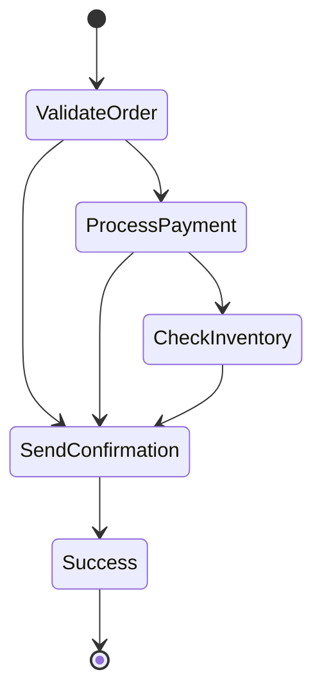

Step Functions let you turn messy Lambda chains into visual workflows. With intrinsic functions, JSONata, and variables, you can accomplish advanced data transformations without writing glue code. Let's dive in.

<!--truncate-->

## Introduction

You're building an app. You've gone all-in on microservices, wiring everything with AWS Lambda. It feels modular and efficient. Each Lambda is doing its job beautifully.  

Life is good — until the app grows. Suddenly, functions need to talk to each other, pass data around, and behave like teammates in a relay race.  

Take a simple e-commerce workflow:  

1. Validate the customer's order  
2. Process the payment  
3. Check inventory  
4. Reserve the item  
5. Send a confirmation email  

Five straightforward steps. But connecting them? That's where things get messy.  
We end up writing endless "glue code," debugging integrations, and spending more time orchestrating than solving real business problems.  

This is where **AWS Step Functions** change the game.  

Instead of writing orchestration code by hand, Step Functions let us visually design workflows. AWS handles retries, error handling, and state transitions behind the scenes.  

Why does this matter? Because with Step Functions we:  
- Save time by cutting out unnecessary code  
- Build reliable, maintainable workflows  
- Gain real-time visibility with a visual execution view  

Let's dive in.

## What Are Step Functions?

**AWS Step Functions** is a fully managed **serverless orchestration service**.  

- It allows you to define workflows in the **Amazon States Language (ASL)**, a JSON-based DSL.  
- You can coordinate AWS services and external APIs into resilient workflows without writing boilerplate code.  
- It supports **microservice orchestration**, **batch processing**, and **event-driven applications**.  

## Key Features

- **Visual workflow design** with a drag-and-drop-like JSON definition  
- **Serverless and fully managed** — no servers to patch  
- **Retries, error handling, and input/output mapping** built in  
- **Native integrations** with Lambda, S3, DynamoDB, SNS, SQS, ECS, EventBridge, and even external APIs via HTTP  
- **Execution history and monitoring** through the AWS Console  
- **High availability and reliability** out of the box  

## Types of Step Functions

Step Functions offer **two workflow types**:

### Standard Workflows
- Designed for **long-running** workflows (up to 1 year).  
- Provide **detailed execution history and auditing**.  
- Ideal for complex business processes with retries and waiting.  

### Express Workflows
- Optimized for **high-volume, short-duration executions**.  
- Cost-effective for event-driven architectures.  
- Perfect for workloads like streaming data ingestion or lightweight API orchestration.  

## Major Components

- **State Machine**: The workflow definition itself.  
- **States**: Individual steps (e.g., `Task`, `Choice`, `Pass`, `Wait`).  
- **Transitions**: Define flow between states.  
- **Input & Output**: JSON passed between states.  
- **Activities**: Long-running external tasks.  
- **Error Handling & Retries**: Built-in resiliency.  
- **IAM Roles**: Permissions to access AWS resources.  
- **Execution**: A running instance of the workflow.  
- **Monitoring**: CloudWatch integration for logs and metrics.  
- **Service Integrations**: Direct calls to other AWS services.  

## Intrinsic Functions

Before **intrinsic functions**, we often created Lambda functions just for trivial operations like string concatenation or math. High maintenance for low-value work.  

In **2022**, AWS introduced **intrinsic functions**, enabling lightweight data manipulation directly inside Step Functions.  

Examples:  
- `States.Format` → string formatting  
- `States.MathAdd` → math operations  
- `States.ArrayLength` → array manipulation  
- `States.Timestamp` → date/time handling  

This shift reduced the need for "helper Lambdas" and pushed Step Functions toward **no code** orchestration.  

## JSONata & Variables

By **2024**, Step Functions became even more powerful with **JSONata expressions** and **variables**.  

- **Variables**: Assign values in one state and reuse them later without passing bulky payloads.  
- **JSONata**: A declarative query and transformation language for JSON. It allows filtering, mapping, and reshaping data inline.  

Together, they unlock advanced data manipulation **without Lambda**.  

Example JSONata usage:  
```json
{
  "items": [
    { "price": 10 },
    { "price": 20 }
  ],
  "total": "$sum(items.price)"
}
````

Result → `total = 30`


## Towards No Code

With **intrinsic functions**, **JSONata**, and **variables**, Step Functions can:

* Process data dynamically
* Run parallel loops with concurrency control
* Handle retries and errors natively

Meaning: you can orchestrate entire **ETL pipelines** or **API workflows** with no Lambda glue code.

This is the realm of **No Code orchestration**.


## Example Walkthrough

Let’s put theory into practice and design a **simple order processing workflow** — end-to-end — using **Step Functions**, **intrinsic functions**, and **JSONata**.

The flow:

1. Validate input
2. Process payment
3. Check inventory
4. Send confirmation

We’ll see how each piece fits together — without writing a single line of glue code.


### 1. Workflow Diagram



**Type:** `Standard` workflow — because it runs across multiple systems and may take a few minutes to complete.

### 2. Basic State Machine Definition

```json
{
  "Comment": "Order processing workflow",
  "StartAt": "ValidateOrder",
  "States": {
    "ValidateOrder": {
      "Type": "Task",
      "Resource": "arn:aws:lambda:us-east-1:123456789012:function:ValidateOrder",
      "Next": "ProcessPayment"
    },
    "ProcessPayment": {
      "Type": "Task",
      "Resource": "arn:aws:lambda:us-east-1:123456789012:function:ProcessPayment",
      "Next": "CheckInventory"
    },
    "CheckInventory": {
      "Type": "Task",
      "Resource": "arn:aws:lambda:us-east-1:123456789012:function:CheckInventory",
      "Next": "SendConfirmation"
    },
    "SendConfirmation": {
      "Type": "Task",
      "Resource": "arn:aws:lambda:us-east-1:123456789012:function:SendEmail",
      "End": true
    }
  }
}
```

A simple linear sequence where each step calls a Lambda. No retry logic yet — just orchestration.

### 3. Add Intrinsic Functions

Instead of adding a Lambda just to compute totals or format strings, use **intrinsic functions** like `States.MathAdd` and `States.Format`.

```json
{
  "CalculateTotal": {
    "Type": "Pass",
    "Parameters": {
      "subtotal.$": "$.order.subtotal",
      "taxRate": 0.08,
      "total.$": "States.MathAdd($.order.subtotal, States.MathAdd($.order.subtotal * 0.08, 0))"
    },
    "Next": "ProcessPayment"
  }
}
```

We compute the total inside Step Functions — no helper Lambda required.

### 4. Introduce Variables

Variables store intermediate results for reuse across states.

```json
{
  "ValidateOrder": {
    "Type": "Task",
    "Resource": "arn:aws:lambda:us-east-1:123456789012:function:ValidateOrder",
    "ResultPath": "$.validation",
    "Next": "SaveVariables"
  },
  "SaveVariables": {
    "Type": "Pass",
    "Parameters": {
      "orderId.$": "$.validation.orderId",
      "customerEmail.$": "$.validation.customer.email"
    },
    "Next": "ProcessPayment"
  }
}
```

We extract `orderId` and `customerEmail` once and reuse them later — without carrying a massive payload between states.

### 5. Use JSONata for Data Transformation

JSONata expressions let you reshape or compute data inline.

```json
{
  "TransformOrder": {
    "Type": "Pass",
    "Parameters": {
      "summary": {
        "orderId.$": "$.order.id",
        "total.$": "$sum($.order.items.price)",
        "itemNames.$": "$join($.order.items.name, ', ')"
      }
    },
    "Next": "SendConfirmation"
  }
}
```

Here, JSONata computes the order total and merges item names into a single string.


### 6. Direct Service Integrations

Step Functions can call AWS services **directly** — no Lambda needed.

Example: send an email via **Amazon SES**.

```json
{
  "SendConfirmation": {
    "Type": "Task",
    "Resource": "arn:aws:states:::aws-sdk:ses:sendEmail",
    "Parameters": {
      "Destination": {
        "ToAddresses.$": "[$.customerEmail]"
      },
      "Message": {
        "Body": {
          "Text": {
            "Data.$": "States.Format('Order {} confirmed! Total: ${}', $.orderId, $.total)"
          }
        },
        "Subject": { "Data": "Order Confirmation" }
      },
      "Source": "orders@myshop.com"
    },
    "End": true
  }
}
```

No Lambda required — Step Functions calls SES directly and uses intrinsic functions for dynamic message text.


### 7. Express Workflow Variant

For **high-volume, short-lived** jobs (like logging or webhook processing), just change the workflow type to **Express**:

```json
{
  "StateMachineType": "EXPRESS"
}
```

Express workflows trade detailed logs for scale and lower cost — ideal for event-driven systems.

## Conclusion

Yes, you *could* orchestrate microservices by hand, wiring up Lambdas, writing glue code, and hoping it scales. Or you could use Step Functions.

Step Functions give you:

* **Cleaner workflows**
* **Less code to maintain**
* **Reliability and visibility**
* **Intrinsic functions and JSONata** to replace trivial Lambdas

The takeaway: Step Functions let us focus on **business logic**, not orchestration code.

Happy building — and happy coding with **no code**. 🎉