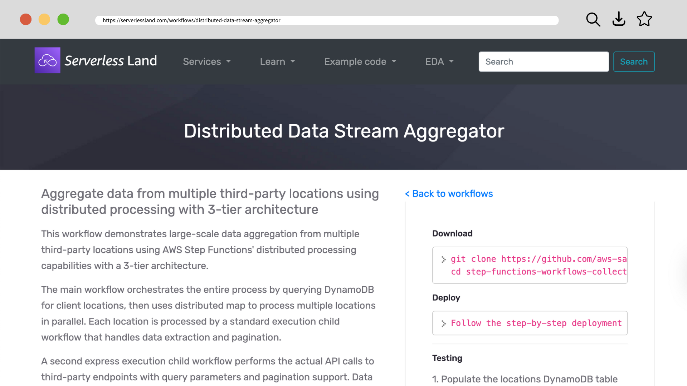
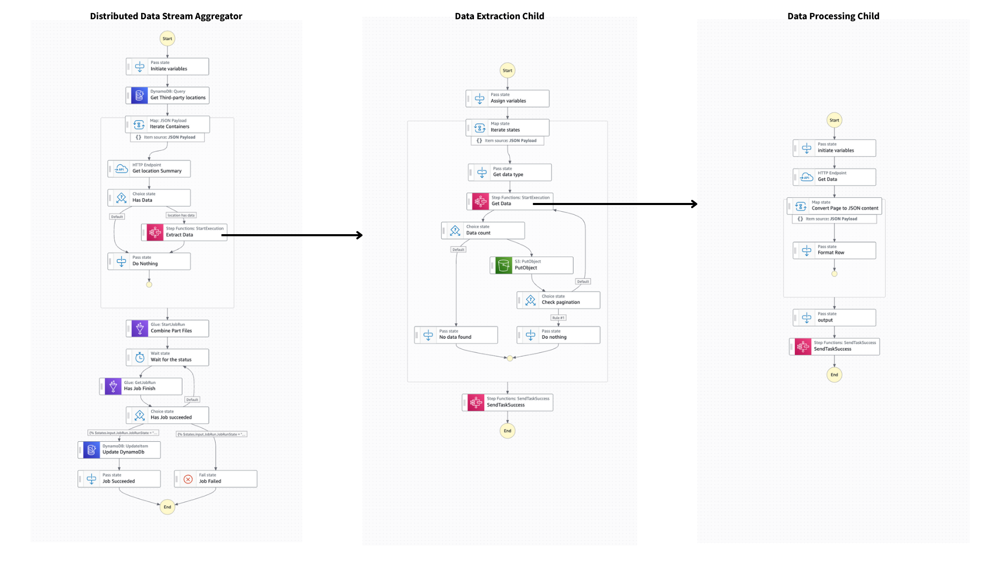
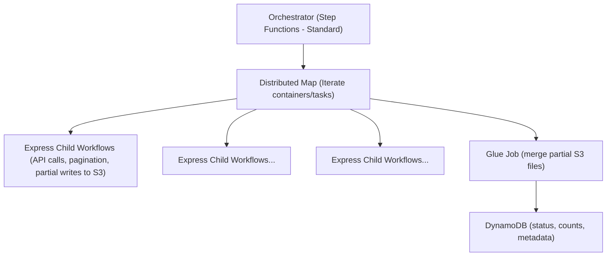
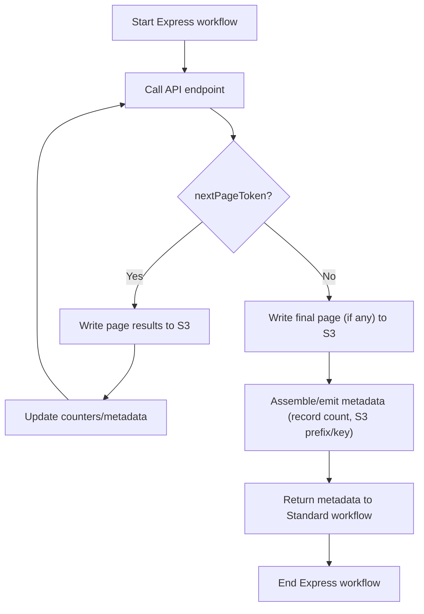

A comprehensive **Distributed Data Stream Aggregator** workflow that demonstrates large-scale data aggregation from multiple third-party locations using AWS Step Functions' distributed processing capabilities.

A key highlight of this solution is its **unique no-Lambda approach**, making it a **low-code (almost no-code)** architecture — with minimal coding required only in the AWS Glue job for final consolidation.

<!--truncate-->


## Introduction


See: https://serverlessland.com/workflows/distributed-data-stream-aggregator

When working at scale, coordinating the ingestion of data from many external APIs — with pagination, retries, rate limits, and large payloads — gets complicated fast. The typical solution often leans heavily on AWS Lambda, which brings its own operational and scaling burdens.

This post walks through a new, Lambda-free pattern contributed to the [AWS Step Functions Workflows Collection](https://github.com/aws-samples/step-functions-workflows-collection/pull/404): a **three-tier, distributed data aggregator** using Step Functions (standard + express), S3, Glue, and DynamoDB. You'll see how to orchestrate high fan-out, handle payload limits, and maintain observability — all with minimal custom code.

I'll cover:

* The overall architecture and rationale
* How each tier works (orchestrator, express children, aggregation)
* Key AWS Step Functions configurations (Distributed Map, concurrency, error handling)
* Tradeoffs, best practices, and when to use this pattern

By the end, you'll have a blueprint you can adapt for your own large-scale data-aggregation use cases.

## Solution Overview & Motivation

### The Problem Space

Suppose you manage hundreds of locations or entities, and for each one you need to call multiple external APIs (each with pagination, retries, rate limits) and aggregate a combined dataset. You also expect that the result for a single location might exceed Step Functions' 256 KB state payload limit (so you can't carry full results inline).

Many teams solve this with a web of Lambda functions:

1. Lambda A fans out tasks
2. Lambda B handles HTTP calls + pagination
3. Lambda C aggregates results
4. Etc.

This introduces more code, more error surfaces, and scaling headaches.

What if you could move more logic into Step Functions itself, let AWS handle the orchestration, and offload heavy work to managed services (S3, Glue) — with **zero Lambda**?

That's exactly what this new workflow achieves.

### Architecture at a Glance



Here's the high-level flow:



* The **orchestrator** acts as the parent state machine (Standard mode).
* It uses **Distributed Map** to iterate over “containers” (e.g. location or entity).
* For each item, an **Express child state machine** is invoked to perform HTTP API calls, pagination, and write partial results to S3.
* Once all child executions complete, the orchestrator triggers a **Glue job** to merge partial outputs into a final consolidated dataset.
* A **DynamoDB table** tracks status, metrics, and metadata.

Because partial results live in S3 (not in Step Functions' state), I avoid payload size limits and keep orchestration logic lightweight.

## How It Works: Step by Step

Let's dive into each part of the workflow in more detail, along with key configurations.

### 1. Parent Orchestrator + Distributed Map

The parent state machine is implemented in **Standard** Step Functions mode. Its key job is to fan out work using a **Distributed Map** state. Because I adopt the distributed mode, the state machine does *not* manage all iterations internally — that offloads scale to AWS.

Here's a representative snippet:

```json
{
  "Type": "Map",
  "Label": "IterateContainers",
  "ItemProcessor": {
    "ProcessorConfig": {
      "Mode": "DISTRIBUTED"
    }
  },
  "MaxConcurrency": 5,
  "ItemSelector": {
    "container.$": "$.container"
  },
  "Iterator": {
    "StartAt": "StartExpressChild",
    ...
  }
}
```

* `Mode: DISTIBUTED` tells Step Functions to spawn independent child executions per item.
* `MaxConcurrency` (e.g. set to 5) throttles how many child executions run in parallel, helping avoid overwhelming external APIs.
* Each child receives one “container” item (e.g. a location or entity) to process.

After the Map completes, the parent moves on to aggregation and status update steps (e.g. calling Glue, writing to DynamoDB).

### 2. Express Child Workflows: Data Fetch & Pagination

Each Express child workflow is responsible for:

* Making HTTP (or other) API calls
* Handling pagination (if the API returns a “next page” token)
* Retrying on transient errors (with exponential backoff)
* Writing partial results to S3
* Returning a small summary to the parent

Because Express workflows are lightweight and ephemeral, they're ideal for short-lived data-fetch tasks. But because they're “express”, they don't offer exactly the same durability guarantees as Standard — so design accordingly (e.g. idempotency, retries, monitoring).

A simplified flow inside an Express child might look like:



* Call API endpoint
* Check for `nextPageToken`
   * If yes, loop / re-enter the state
   * If no, finish
* Accumulate or write result chunk(s) to S3
* Return a small metadata payload (e.g. record count, S3 key)

Because full datasets for a container may be large, the child never returns full data in the Step Functions state. Instead, it writes into S3 — e.g. `s3://bucket/jobID/containerX.json`.

### 3. Aggregation via Glue

Once all Express children complete, the orchestrator triggers an AWS Glue job. Its responsibility:

* Scan the “job prefix” in S3 (e.g. `s3://bucket/jobID/`)
* Read all partial files
* Merge / union them into a final dataset
* Write out a consolidated result (e.g. JSON, Parquet, CSV)

This offloads heavy merging/aggregation out of Step Functions and into Glue, which is built for data processing scale.

### 4. Status Tracking with DynamoDB

Parallel to Glue, or after Glue completes, orchestrator writes execution metadata into a **DynamoDB** table. Fields typically include:

* Job ID
* Start / end timestamps
* Number of containers processed
* Number of records aggregated
* Status (succeeded / failed / partial)
* Retry counters or error messages

This gives you an external, queryable log of workflow runs beyond the Step Functions execution history.

## Why This Pattern Matters

Let's compare this approach to a more traditional Lambda-centric pattern, and see why this might be a better fit in many cases.

| Challenge / Constraint  | Traditional Lambda-Driven Approach               | This No-Lambda Distributed Pattern                                 |
| ----------------------- | ------------------------------------------------ | ------------------------------------------------------------------ |
| Payload size limits     | Often need to chunk or stream through Lambda     | Results are stored in S3, not carried in state                     |
| Lambda code maintenance | You write and maintain dozens of functions       | Minimal or zero custom code (just config + glue script)            |
| Scaling & orchestration | You must manage concurrency, cold starts         | Step Functions + Distributed Map abstracts much orchestration      |
| Fault isolation         | Failures in one Lambda might affect others       | Each child is isolated; individual retries possible                |
| Cost model              | You pay for Lambda execution time per invocation | You pay for state transitions, Glue job, and S3 access             |
| Observability           | You need to build logging/tracing across Lambdas | Step Functions gives built-in visibility; DynamoDB logs augment it |

This pattern is especially suited when:

* You have **many entities or containers** to fetch in parallel
* Data per container can be large (bigger than 256 KB)
* You prefer **infrastructure as configuration** over custom code
* You want to minimize the Lambda surface area

That said, it's not a silver bullet — which leads us to tradeoffs and things to watch out for.


## Tradeoffs & Design Considerations

1. **Express vs Standard Workflows**
   Express workflows are fast and cost-efficient, but with lower execution duration and less durability guarantees. If your data fetch tasks are long-running or mission-critical, consider Standard children (though that complicates concurrency and cost).

2. **Glue Cold Starts and Overheads**
   Glue adds latency (job startup) and cost overhead. For small datasets, a Lambda might still be more efficient. But for large aggregations, Glue's scale wins.

3. **Error Handling Strategy**
   Because failures can occur per container, tune retry policies on the Express children. Ensure idempotency so partial retries are safe. Also, design fallback or compensation logic (e.g. mark container as failed in DynamoDB and continue with others).

4. **State Transition Costs**
   Step Functions charges per state transition. Avoid overly fine-grained state machines, and batch work cleverly when possible to limit excessive transitions.

5. **Concurrency & Rate Limits**
   Setting `MaxConcurrency` properly is crucial to avoid hitting API rate limits. You may need dynamic throttling or backoff logic if API limits vary per container.

6. **Monitoring & Visibility**
   Combine Step Functions' built-in execution view with DynamoDB logs and CloudWatch metrics. Use alarms for failed executions or excessive retries.

## Example Walkthrough

Here's a hypothetical example run:

1. Input includes 50 containers (e.g. locations) to process.
2. Parent orchestrator uses Distributed Map to launch 50 child executions, but only 5 run concurrently (due to `MaxConcurrency = 5`).
3. Each Express child:
   * Calls an external API endpoint
   * If the API returns a `nextPageToken`, loops until pagination is exhausted
   * Writes each page's data to `s3://bucket/job-123/containerX-pageY.json`
   * Returns metadata: `{ "container": "X", "pages": 3, "s3Prefix": "job-123/containerX/" }`
4. After all children finish, the parent triggers Glue to read all partial JSONs under `job-123/`, merge them, and produce `job-123/final-output.json`.
5. The parent writes to DynamoDB: start time, end time, number of containers, number of records, success/failure, etc.
6. The caller or UI can query DynamoDB for job status, or review the merged output in S3 or downstream systems.

## Getting Started & Deployment Guidance

Here are steps you can follow to try this pattern:

1. **Clone the sample repo** (https://github.com/aws-samples/step-functions-workflows-collection/tree/main/distributed-data-stream-aggregator) and examine the ASL definitions.
2. **Deploy the orchestration + children** via CloudFormation or CDK.
3. **Write a Glue script** that merges JSON / CSV parts — this can be minimal.
4. **Define your DynamoDB table** schema (job metadata).
5. **Test locally with a small number of containers** to validate pagination, S3 writes, and retries.
6. **Scale up and tune `MaxConcurrency`**, error policies, and Glue timeout.
7. **Add CloudWatch metrics / alarms / dashboards** to monitor failures, retries, and throughput.

You can also adapt parts:

* Swap Glue for Athena, Redshift, or Lambda-based merging
* Use more advanced backoff or token-bucket throttling strategies
* Add conditional branching (e.g. skip certain containers)
* Extend error compensation logic (e.g. partial result salvage)

## Conclusion

In this post, I've walked through a compelling, Lambda-less pattern for distributed data aggregation using AWS Step Functions, S3, Glue, and DynamoDB. By leveraging **Distributed Map** and offloading heavy work into managed services, you gain scalable, maintainable, and resilient workflows with less custom code.

This approach is ideal when your data per entity is large, your orchestration logic is complex, and you want to reduce Lambda sprawl. That said, always balance tradeoffs (Glue latency, Express durability, cost) and experiment with tuning.
